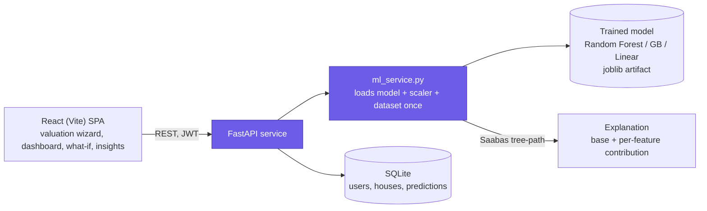
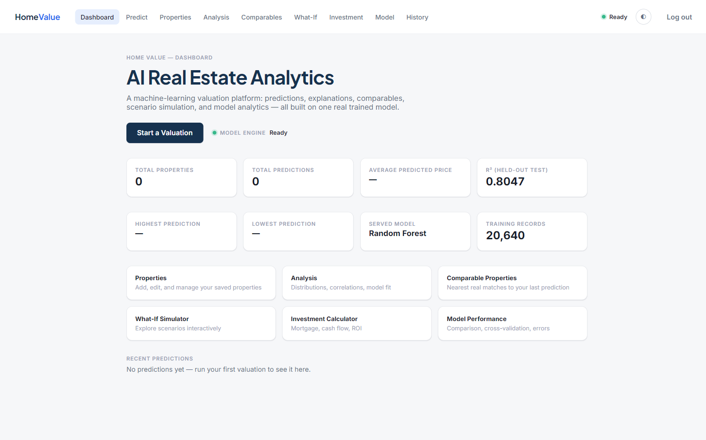
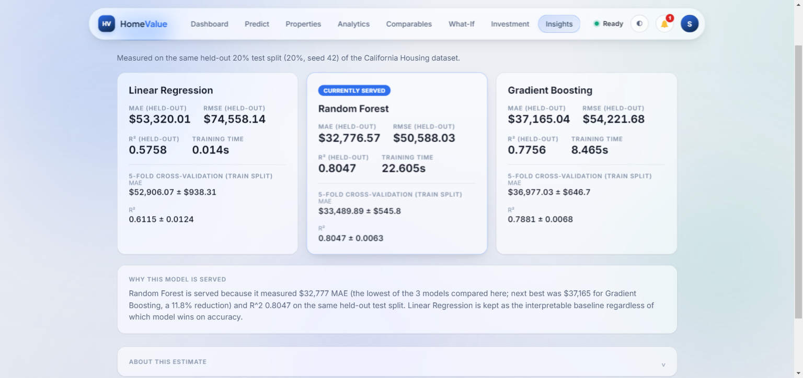
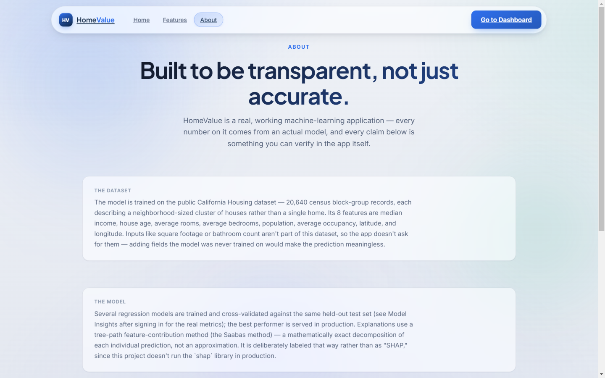
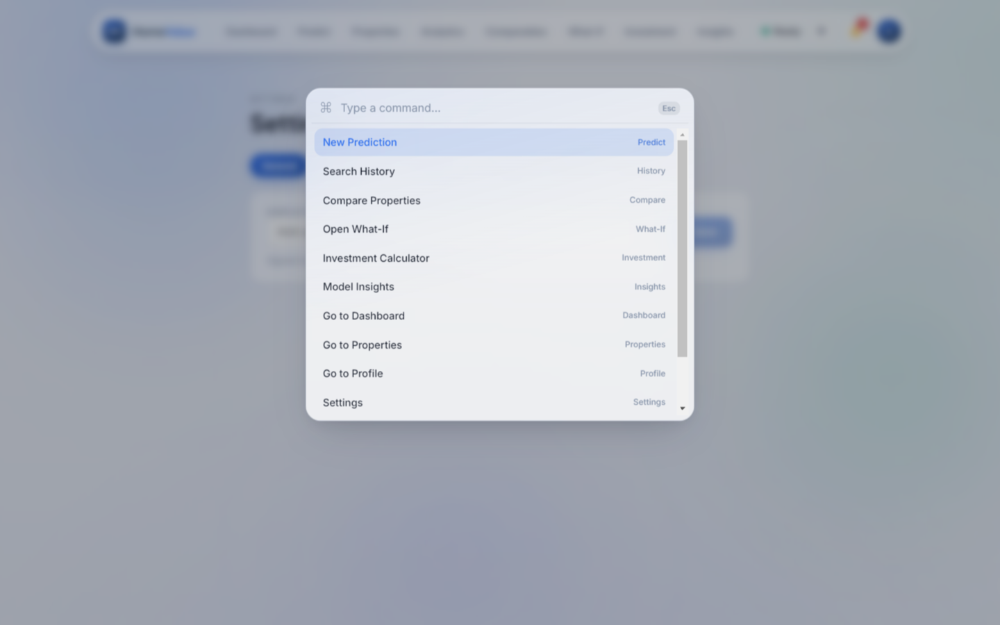
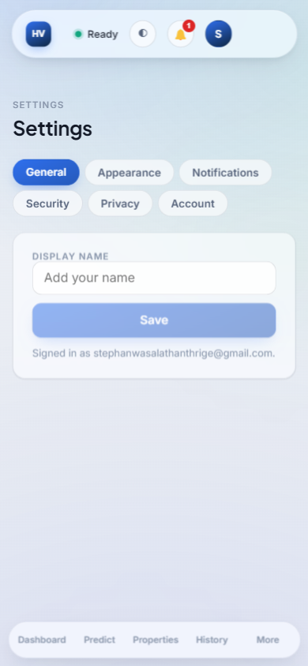
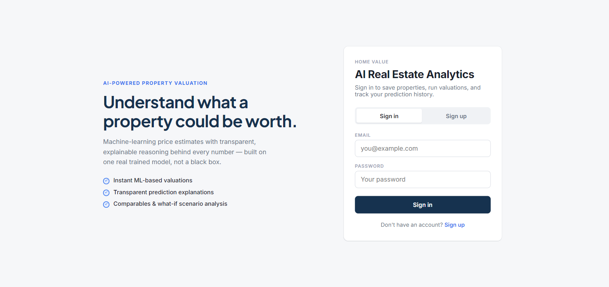
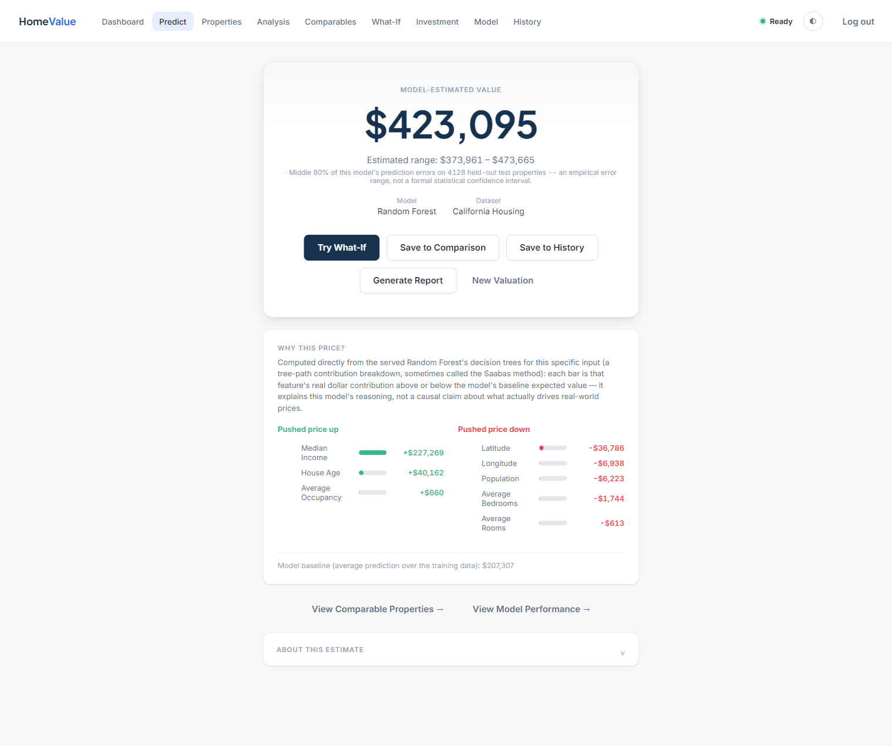
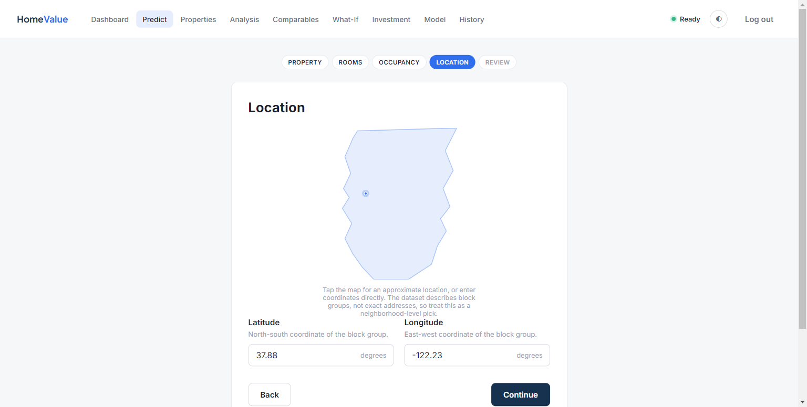

<p align="center"></p>

<p align="center">


</p>

# HomeValue — AI Real Estate Intelligence Platform

A full-stack AI real estate intelligence platform built around one real
trained machine-learning model on the California Housing dataset. Predict a
property's value, understand exactly why via feature-contribution
explanations, compare saved properties, run what-if scenarios, size up the
investment math, and track prediction history — all backed by a real
per-user database, not local-only demo state.

**Live demo:** https://house-price-predictor-three-nu.vercel.app
(frontend on Vercel; backend on Azure App Service at
`house-price-predictor-stephan.azurewebsites.net` — see
[Deployment](#deployment) for redeploy instructions). Sign up with any
email — there's no seeded account.

## Project overview

The product flow is **Predict → Understand → Compare → Simulate → Analyze
→ Decide**: run a valuation, see the feature-level explanation behind the
number, compare it against saved properties, explore "what if" scenarios,
dig into dataset/model analytics, and run the investment numbers — all on
the same real model, never a mockup.

Every number in the product traces back to something real: a trained
scikit-learn model, the actual California Housing dataset, or arithmetic
over inputs you typed in. Nothing is fabricated to look impressive — where
there isn't enough real data yet (a new account with no predictions), the
UI shows an honest empty state instead of a fake statistic.

## Architecture



```
frontend/   React (Vite) SPA — react-router-dom routes for public marketing
            pages, auth, dashboard, property management, valuation flow,
            analysis, model insights, prediction history, profile/settings
backend/    FastAPI service — auth, CRUD, and the ML pipeline, backed by
            SQLite (SQLAlchemy)
ml/         Trains the model and benchmarks alternatives; writes the JSON
            artifacts the backend serves (model_comparison.json,
            dataset_stats.json, evaluation_results.json)
```

The backend never re-implements the ML logic per request: `ml_service.py`
loads the trained model, scaler, and dataset artifacts once at import time,
and every route (`/predict`, `/predictions`, `/comparables`, ...) calls the
same functions.

### Frontend routing

```
Public:         /  /about  /features
Auth (guest):   /login  /signup  /forgot-password  /reset-password
Authenticated:  /dashboard  /predict  /properties  /market-analytics
                /comparables  /what-if  /investment  /model-insights
                /history  /compare  /profile  /settings
```

Real URL routes via `react-router-dom` — refresh, deep-link, and browser
back/forward all work. `RequireAuth` gates the authenticated routes;
`GuestOnly` redirects an already-signed-in user away from `/`, `/login`,
`/signup`, and the password-reset pages.

## Features

- **Authentication** — email/password signup and login, JWT sessions,
  PBKDF2-HMAC-SHA256 password hashing (no plaintext, no third-party auth
  dependency), "remember me" (session vs. persistent token storage),
  optional display name. Every route except `/health` and `/auth/*`
  requires a signed-in user.
- **Forgot / reset password** — a real, single-use, 30-minute-expiring
  token flow. No email service is configured for this project, so it runs
  in **demo mode**: the reset link is shown directly in the UI (clearly
  labeled) instead of emailed. Swap in a real provider by having
  `/auth/forgot-password` send the token by email instead of returning it.
- **Property management** — full CRUD on saved properties (the model's
  actual 8 input features, not invented fields like square footage that
  the model was never trained on), with search, sort, and per-user
  isolation.
- **Predictions** — `/predict` stays a stateless preview (used by the
  guided valuation flow and the What-If simulator, which calls it on every
  slider change); `/predictions` runs the same model and persists the
  result, optionally linked to a saved property. Explanations are computed
  as tree-path contributions (Saabas method) — mathematically exact for a
  Random Forest, without SHAP's heavy native dependencies. The UI always
  labels this as "tree-path contribution," never as SHAP.
- **What-If simulator** — change an input and instantly see Current vs.
  Scenario vs. Difference, seeded from your most recent real prediction.
- **Property comparison** — save predictions to a comparison basket and
  line up to 4 side by side across every model input, the predicted
  value, and the served model.
- **Comparable properties** — k-NN nearest real dataset records to your
  most recent prediction's inputs.
- **Investment calculator** — monthly payment, cash flow, rental yield,
  cash-on-cash ROI, and break-even from clearly labeled financial
  assumptions (never presented as ML output).
- **Prediction history** — search, sort, date filter, multi-select
  compare, CSV/JSON export, delete.
- **Model insights** — Linear Regression, Random Forest, and Gradient
  Boosting benchmarked on the same held-out split (MAE, RMSE, R², 5-fold
  cross-validation, training time), real feature importance, dataset
  explorer, error analysis. Nothing here is invented — every metric comes
  from `ml/compare_models.py`'s actual run.
- **Dashboard** — time-of-day greeting, quick actions, real per-user
  metrics (predictions made, saved properties, average predicted value,
  recent activity), a prediction-activity chart and prediction-value
  distribution built from your own real prediction history (hidden behind
  an honest "run a couple more valuations" prompt until there's enough
  data), a recent-predictions table, and your comparison basket status.
- **Command palette** (Ctrl/Cmd+K) — jump to any page, toggle theme, or log
  out without leaving the keyboard.
- **Notification center** — a persisted, real event log (prediction saved,
  property added/updated/deleted, sign-in) distinct from the floating
  toasts, with read/unread state; Settings > Notifications controls
  whether events also pop up as a toast.
- **Profile & Settings** — edit display name; Appearance (theme, glass
  intensity, reduce motion, compact mode — all real, all applied
  immediately); Notifications (toast toggles); Security (change password);
  Privacy (export your data as JSON, delete your account — a real,
  cascading deletion); Account summary.
- **Public marketing pages** — Home, Features, and an About page that
  documents the real dataset, model, and the Saabas-vs-SHAP explainability
  choice, so the "no fabricated claims" rule extends to the marketing copy
  too.
- **Natural-language property description** (Gemini-assisted, optional) —
  extracts candidate feature values from free text, never a price.

## ML model & dataset

- **Dataset**: the public California Housing dataset — 20,640 real census
  block-group records. Each row describes a neighborhood-sized cluster of
  houses, not a single home.
- **Features** (exactly 8, real, unchanged): `MedInc`, `HouseAge`,
  `AveRooms`, `AveBedrms`, `Population`, `AveOccup`, `Latitude`,
  `Longitude`. The app deliberately does not ask for square footage,
  bathroom count, garage, or year built — those aren't in this dataset,
  and adding them without retraining the model would make the prediction
  meaningless.
- **Models compared**: Linear Regression (interpretable baseline), Random
  Forest, Gradient Boosting — all evaluated on the same held-out 20% test
  split, with 5-fold cross-validation. The lowest-MAE model is served in
  production; see `/model-insights` after signing in for the live numbers.
- **Explainability**: a hand-rolled tree-path feature-contribution method
  (the Saabas method) — walks each tree's exact decision path for the
  input and attributes the value delta at each split to that split's
  feature, averaged across the forest. Mathematically exact
  (base + contributions = prediction), not an approximation, and not
  Shapley-consistent like true SHAP — so it's labeled "tree-path
  contribution," never "SHAP." (The `shap` package's native dependencies
  made an earlier Azure App Service deploy unreliable; this is a real
  technical tradeoff, not a shortcut.)

## Tech stack

- **ML**: scikit-learn (RandomForestRegressor, GradientBoostingRegressor,
  LinearRegression), joblib, NumPy
- **Backend**: FastAPI, SQLAlchemy + SQLite, PyJWT, Pydantic, httpx/google-genai
  (optional NL input)
- **Frontend**: React 19, Vite, react-router-dom, no CSS framework — a
  from-scratch "Liquid Glass" design system on CSS custom properties
  (`frontend/src/styles/theme.css`)
- **Testing**: pytest + FastAPI's TestClient

## API documentation

| Method | Path | Auth | Description |
|---|---|---|---|
| GET | `/health` | — | Liveness check |
| POST | `/auth/signup` | — | Create an account (optional display name), returns a JWT |
| POST | `/auth/login` | — | Returns a JWT |
| GET | `/auth/me` | ✓ | Current user |
| PATCH | `/auth/me` | ✓ | Update display name |
| DELETE | `/auth/me` | ✓ | Delete account (cascades to houses/predictions) |
| POST | `/auth/change-password` | ✓ | Change password |
| POST | `/auth/forgot-password` | — | Generates a reset token (demo mode: returned in the response if the account exists; never reveals whether it does) |
| POST | `/auth/reset-password` | — | Consumes a valid, unexpired, unused token to set a new password |
| POST | `/predict` | ✓ | Stateless prediction preview (not persisted) |
| POST | `/comparables` | ✓ | k-NN nearest real properties by feature similarity |
| GET | `/dataset-sample` | ✓ | Sampled real rows for charting |
| POST | `/parse-description` | ✓ | Gemini-assisted free-text → feature extraction |
| GET | `/model-info` / `/model-comparison` / `/model-evaluations` | ✓ | Served model, full comparison, DB-backed evaluation history |
| GET | `/dataset-stats` / `/evaluation-sample` | ✓ | Dataset stats, held-out test results |
| POST/GET/GET/PATCH/PUT/DELETE | `/houses[/{id}]` | ✓ | Property CRUD, search/sort via query params |
| POST/GET/GET/DELETE | `/predictions[/{id}]` | ✓ | Run + persist a prediction, list/get/delete history |
| GET | `/dashboard/summary` | ✓ | Aggregate stats + recent predictions for the Dashboard page |

Interactive docs (Swagger UI) are available at `/docs` on a running
backend.

## Authentication

JWT-based, stateless sessions (no server-side session table — the signed
token carries the user id). Passwords are hashed with PBKDF2-HMAC-SHA256
(260,000 iterations), never stored in plaintext. "Remember me" on the
login form controls whether the token lands in `localStorage` (persists
across browser restarts) or `sessionStorage` (cleared when the tab/browser
closes). Forgot/reset password issues a real single-use token with a
30-minute expiry — see the demo-mode note under [Features](#features).
Google/OAuth login is intentionally not implemented — it isn't configured
for this project, and the brief for this build was explicit that a
dual-use feature like a login button should never be added unless it's
actually wired up.

## Database

SQLite via SQLAlchemy (`DATABASE_URL` overridable for any other engine).

- **User** — email, password hash/salt, optional display_name, created_at
- **House** — user_id, label, notes, the model's 8 real features
  (med_inc, house_age, ave_rooms, ave_bedrms, population, ave_occup,
  latitude, longitude), timestamps
- **Prediction** — user_id, optional house_id, a snapshot of the features
  actually used (independent of House, so a prediction stays meaningful
  even if the linked property is edited/deleted later), predicted price,
  model used, explanation (base value + contributions), estimated range,
  warnings, created_at
- **PasswordResetToken** — user_id, token, expires_at, used_at — backs the
  forgot/reset-password flow
- **ModelEvaluation** — one row per benchmarked model, upserted from
  `compare_models.py`'s output at backend startup

## Local setup

**Train the model / regenerate comparison artifacts** (only needed once,
or after changing `ml/train_model.py` / `ml/compare_models.py`):
```
cd ml
python train_model.py
python compare_models.py
```

**Backend:**
```
cd backend
pip install -r requirements.txt
uvicorn main:app --reload
```

**Frontend:**
```
cd frontend
npm install
npm run dev
```

Then open `http://localhost:5173` and sign up — there's no seeded account.

### Environment variables

| Variable | Where | Purpose | Default |
|---|---|---|---|
| `DATABASE_URL` | backend | SQLAlchemy connection string | `sqlite:///./house_price.db` |
| `JWT_SECRET_KEY` | backend | Signs session tokens — **set a real secret in any real deployment** | insecure dev fallback |
| `GEMINI_API_KEY` | backend | Enables the "describe your property" NL input | unset (feature disabled) |
| `GEMINI_MODEL` | backend | Which Gemini model to call | `gemini-3.5-flash-lite` |
| `VITE_API_URL` | frontend | Backend base URL | `http://localhost:8000` |

## Testing

```
cd backend
pip install -r requirements-dev.txt
pytest
```

36 tests covering: signup/login (including duplicate email, wrong
password, invalid token, optional display name), profile update, change
password, forgot/reset password (unknown email doesn't leak account
existence, valid token resets the password, tokens are single-use,
invalid tokens are rejected), account deletion (cascades to houses/
predictions), house CRUD and per-user ownership isolation, `/predict`
(auth required, stateless, rejects invalid input), `/predictions`
(persists, links to a house, ownership isolation), the dashboard summary,
and the public `/health` check.

Frontend: `npm run build` (production build) and `npm run lint` (oxlint)
under `frontend/` — no test runner is configured for the frontend yet.

## Deployment

- **Backend** — Azure App Service (Linux, Python 3.12). SQLite lives under
  `/home` (`DATABASE_URL=sqlite:////home/house_price.db`) because the
  app's own code directory is extracted fresh into an ephemeral location
  on every restart — anywhere else would silently lose data. Redeploy
  with a zip built via Python's `zipfile` module (not PowerShell's
  `Compress-Archive`, which writes backslash paths that break on Linux):
  `az webapp deploy -g <rg> -n <app> --src-path backend.zip --type zip`.
- **Frontend** — Vercel. `VITE_API_URL` is set as a Production environment
  variable in the Vercel project (not committed). Redeploy with
  `vercel --prod` from `frontend/`.

## Screenshots

**Dashboard**


**Model Insights**


**About**


**Command palette (Ctrl/Cmd+K)**


**Settings — mobile**


**Sign in / sign up** *(predates the split-route auth pages — pending refresh)*


**Prediction with tree-path explanation**


**Valuation wizard — location step**

